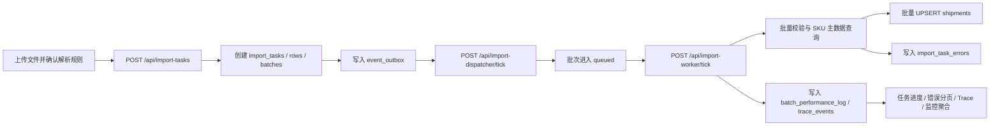

# V2 第十三点提交物清单

## 核对范围

- 需求来源：`E:\ai\exam4\exam-v4-v2-async-event-driven-observability.md` 第十三点。
- V2 项目：`E:\work\aiExam-v2`。
- 线上地址：`https://ai-exam-v2.vercel.app/`。
- 核对日期：2026-08-07。
- 访问核对：通过 VPN 代理 `http://127.0.0.1:7897` 显式访问，返回 `200 OK`，页面标题为 `AI Exam V2 - 运单导入与主数据服务`。

## 强制提交物索引

| # | 提交物 | 交付路径或访问方式 | 核对说明 |
|---:|---|---|---|
| 1 | 在线地址 | `https://ai-exam-v2.vercel.app/` | Vercel 页面可访问，首页即 V2 运单导入与主数据服务。 |
| 2 | 源码仓库 | `https://github.com/sun-x-z/aiExam-v2.git` | 当前项目远端 `origin` 指向该仓库，主分支为 `main`。 |
| 3 | 20,000 条 SKU 主数据脚本 | `scripts/seed-data.mjs`，命令 `npm run seed:perf` | 默认 `SEED_SKU_COUNT=20000`，存在数据库连接串时批量写入 `sku_master`；同时生成压测 Excel。 |
| 4 | 10,000 行压测 Excel | `test-data/10000-orders.xlsx` | 由 `seed:perf` 生成，默认 `SEED_ORDER_COUNT=10000`。 |
| 5 | 压测报告 | `scripts/loadtest-import.mjs`，命令 `npm run loadtest:import` | 脚本上传 10,000 行文件，持续触发 Worker tick，最终输出 `rows`、`uploadMs`、`totalMs`、`successRows`、`failedRows`、`httpErrors`、`pass60s`；`pass60s=true` 表示满足总耗时不超过 60 秒。 |
| 6 | 架构设计文档 | `docs/V2_ASYNC_IMPORT_IMPLEMENTATION.md` | 覆盖异步任务、Outbox、分批处理、批量 SKU 校验、批量 UPSERT、错误明细、Trace 与监控聚合。 |
| 7 | 重构假设说明 | `docs/REQUIREMENT_ASSUMPTIONS.md` | 覆盖模块边界、V2/V3 独立部署、接口契约、缓存一致性、权限和工程假设。 |
| 8 | 接口文档 | `docs/V2_INTERFACE_CONTRACT.md`，`README.md` 的主要 API 列表 | 覆盖上传、任务查询、错误查询、Trace 查询、监控聚合，以及 V2 对 V3 的 `/api/v1/waybills/*` 契约。 |
| 9 | README | `README.md` | 包含本地启动、环境变量、部署/联调边界、压测命令和故障模拟变量。 |
| 10 | 演示账号或访问说明 | 无需账号；访问 `https://ai-exam-v2.vercel.app/` | 首页提供导入工作台、任务进度、错误明细、批次状态、监控汇总和 Trace 查询入口。 |

## 异步导入交付链路



## 验收命令

```powershell
npm run typecheck
npm run build
npm run seed:perf
npm run loadtest:import
```

压测脚本默认读取 `test-data/10000-orders.xlsx`，默认请求 `http://127.0.0.1:3001`。如需压测其他部署环境，可通过 `IMPORT_BASE_URL`、`IMPORT_TEST_FILE`、`IMPORT_BATCH_SIZE`、`IMPORT_WORKER_BATCH_LIMIT` 和 `IMPORT_LOADTEST_TIMEOUT_MS` 覆盖。
